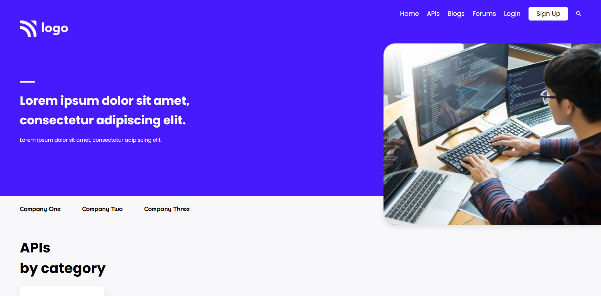
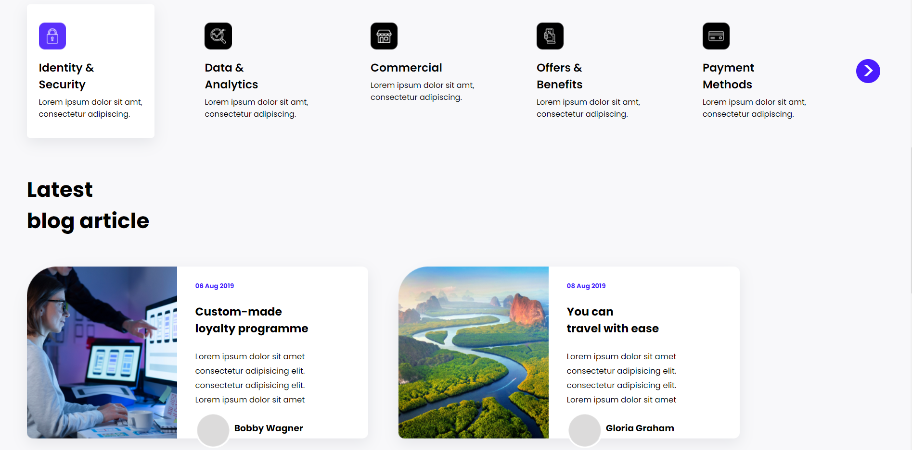
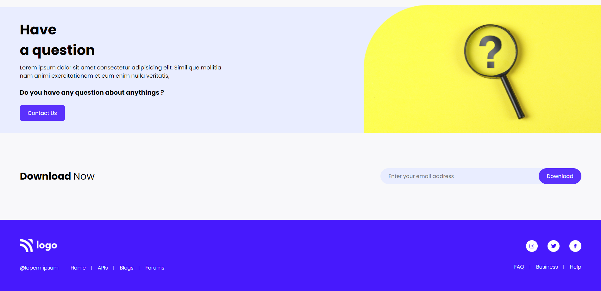

# Developer Landing Page

## :link: [See it live](https://fullstack-js-bc-project-09.netlify.app/)

## :clipboard: Learning Outcomes 

- Use of `float:left` and `float:right` properties
- Also learnt the use of `clear` property to control the flow of next element after the floated elements

## :camera: Screenshot

